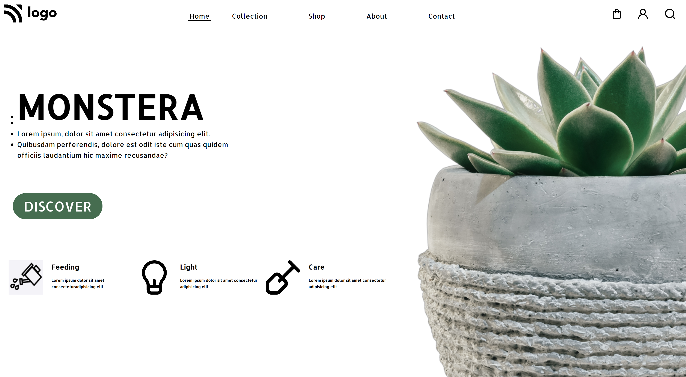

# This project Built With
#### 1.HTML
#### 2.CSS

## Acknowledgements

This landing page, took me almost 6 hrs to complete,this is my project 06 in fullstack development course by ineuron.in.

### During this project I've learned:

1.How to set image in position.
2.How to prevent overflow.
3.How to make two divs close to each other.
4.How to postion element using CSS position properties.

## Here is screen shot of project1.

## Here is live link
[Live link]()